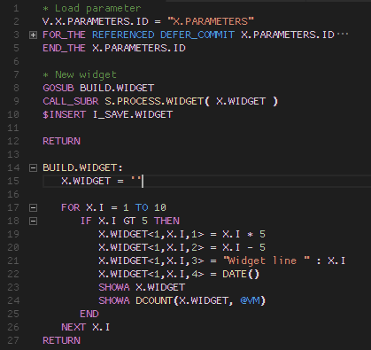

# Envision Basic

This extension adds language support for UniBasic with Envision extensions by [Ellucian](http://www.ellucian.com/Software/Colleague-by-Ellucian/).  

Based on the TextMate definition for Rocketsoft UniBasic created by [Devon McCarty](https://github.com/mrdevon/RocketUnidata)

## Features

- Syntax highlighting and basic code folding for Envision Basic
- File extensions:
  - .ub
  - .eb
  - .ebl *(Used in Colleague Studio workspaces)*

## Requirements

[Visual Studio Code](https://code.visualstudio.com/)

## Installation

1. Install and run Visual Studio Code
2. Open the extension view by pressing `Ctrl-Shift-X` (Windows, Linux) or `Cmd-Shift-X` (macOS)
3. Search for and choose the extension `Envision Basic`
4. Reload Visual Studio Code
## Example

